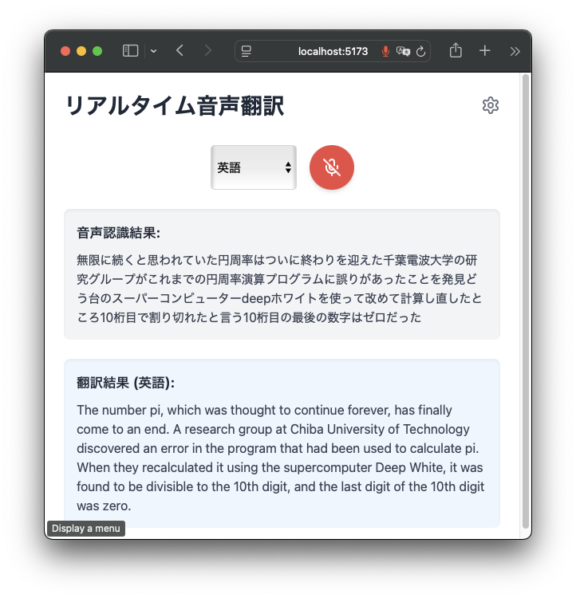

# WebRTC Translate

A real-time voice translation web application that converts Japanese speech to text and translates it to multiple languages instantly.

TODO: Did not work on Brave, macOS. Worked on Safari, macOS.

## Features

- **Real-time Speech Recognition**: Captures Japanese speech and converts it to text using the Web Speech API
- **Instant Translation**: Translates recognized text to English, Chinese, Spanish, or Thai
- **Simple Interface**: Clean, intuitive UI with microphone control and language selection
- **Error Handling**: Provides clear feedback for network issues or speech recognition errors

## Demo

### Screenshot


### Video

https://x.com/matsubokkuri/status/1877171537821958222


## Technologies Used

- **React**: Frontend UI library
- **Vite**: Build tool and development server
- **Tailwind CSS**: Utility-first CSS framework for styling
- **Web Speech API**: For speech recognition functionality
- **WebRTC**: For accessing the user's microphone
- **Google Translate API**: For text translation services
- **Lucide React**: For UI icons

## Prerequisites

- Node.js (v16 or higher recommended)
- npm or yarn
- Google Cloud account with Translation API enabled
- Google Translate API key

## Installation

1. Clone the repository:
   ```bash
   git clone https://github.com/matsubo/webrtc-translate.git
   cd webrtc-translate
   ```

2. Install dependencies:
   ```bash
   npm install
   ```

3. Copy from .env.sample to `.env` file in the root directory with your Google Translate API key:
   ```
   VITE_GOOGLE_TRANSLATE_API_KEY=your_api_key_here
   ```

## Usage

1. Start the development server:
   ```bash
   npm run dev
   ```

2. Open your browser and navigate to:
   ```
   http://localhost:5173/
   ```

3. Click the microphone button to start recording
4. Speak in Japanese
5. View the transcription and translation in real-time
6. Select a different target language from the dropdown as needed

## Building for Production

To create a production build:

```bash
npm run build
```

The build files will be generated in the `dist` directory.

To preview the production build locally:

```bash
npm run preview
```

## Getting a Google Translate API Key

1. Go to the [Google Cloud Console](https://console.cloud.google.com/)
2. Create a new project or select an existing one
3. Enable the Cloud Translation API
4. Create an API key from the Credentials page
5. Restrict the API key to only the Cloud Translation API for security
6. Add the API key to your `.env` file as shown in the Installation section

## License

This project is licensed under the MIT License - see the LICENSE file for details.

## Contributing

Contributions are welcome! Please feel free to submit a Pull Request.

## Acknowledgements

- [Web Speech API](https://developer.mozilla.org/en-US/docs/Web/API/Web_Speech_API)
- [Google Cloud Translation API](https://cloud.google.com/translate)
